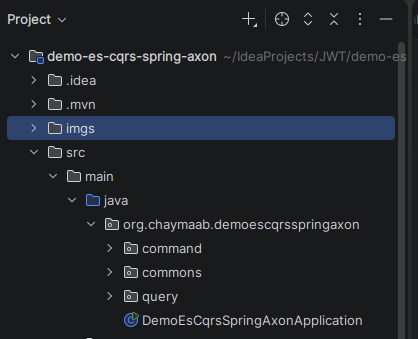
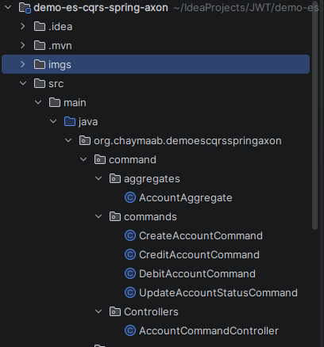
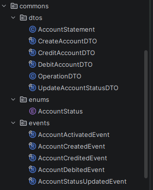
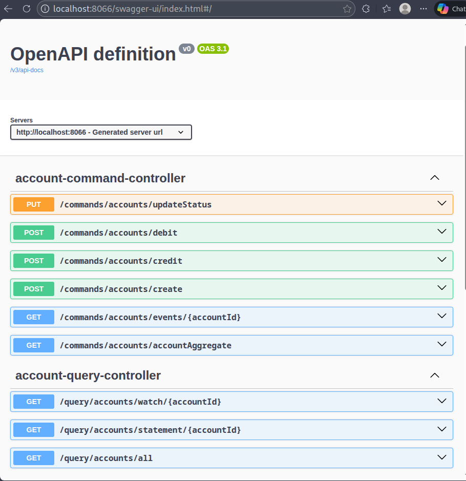
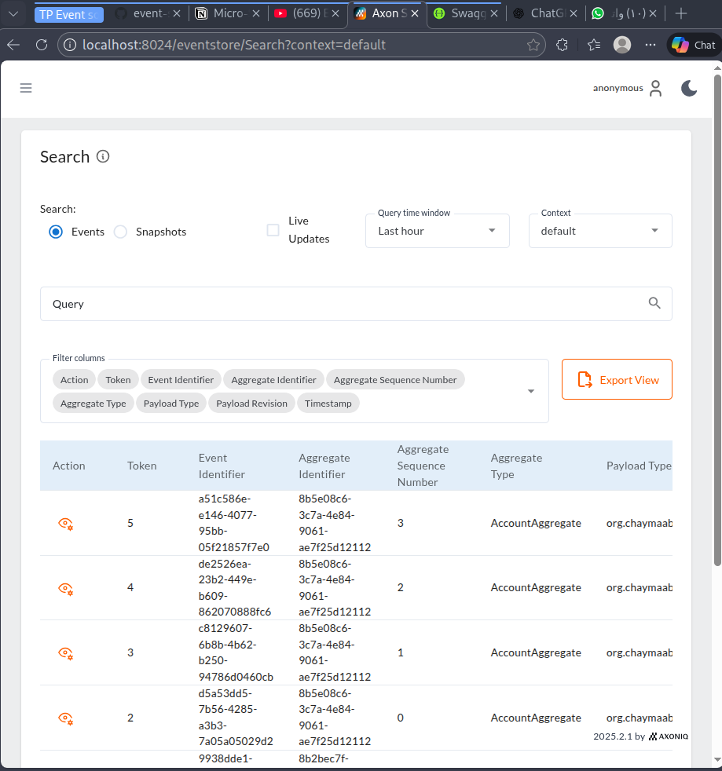
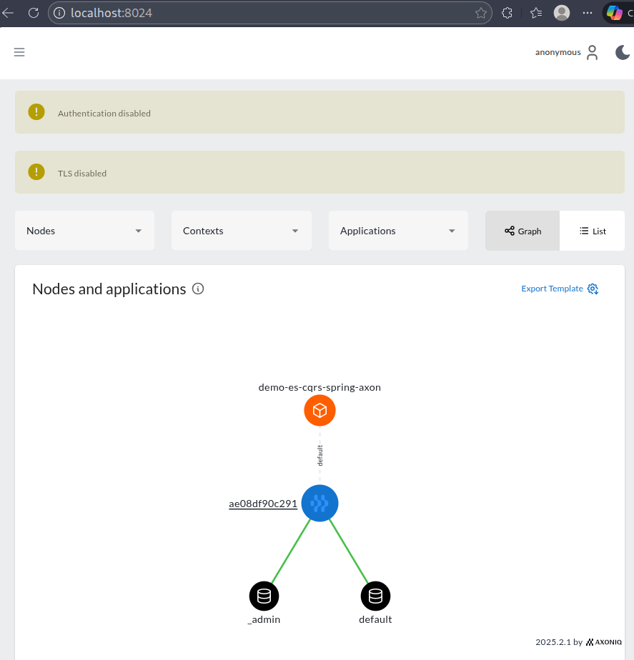
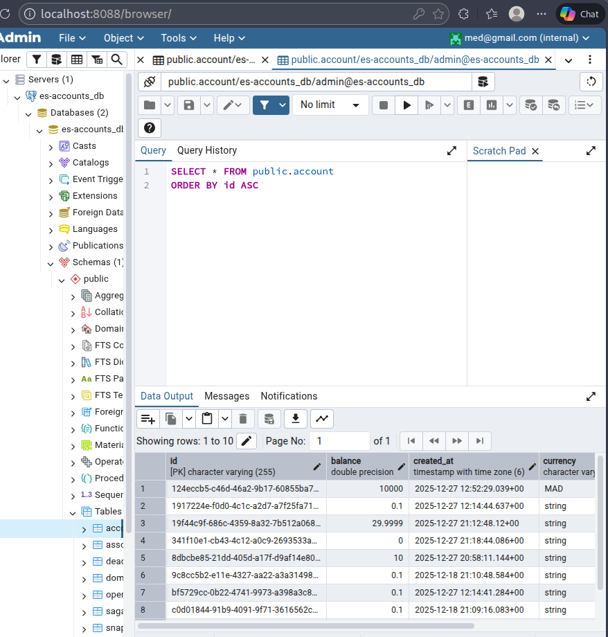

# Event Sourcing & CQRS Bank Account Management Demo

This project is a practical demonstration of implementing **Event Sourcing** and **CQRS (Command Query Responsibility Segregation)** patterns using **Axon Framework**, **Spring Boot**, and **Spring Cloud**. It simulates a simple banking system for managing accounts, illustrating how commands and queries are handled separately with event-driven architecture.

---

## Project Description

The application manages bank accounts, allowing operations such as:

- Creating new accounts with an initial balance and currency
- Activating accounts
- Crediting and debiting accounts with validation rules (e.g., account must be activated, sufficient balance for debit)
- Changing account status (created, suspended, activated, blocked)
- Querying account details and transaction history
- Real-time updates pushed to the frontend via Server-Sent Events (SSE)

The backend is built as a microservice following the CQRS pattern, splitting the write (command) and read (query) models for scalability and maintainability.

---

## Architecture Overview

The architecture is based on two main parts:

### 1. Command Side (Write Model)

- **Handles business operations** like creating accounts, crediting, debiting, and updating account status.
- Uses **Axon Framework Aggregates** to encapsulate domain logic and enforce business rules.
- Commands are dispatched asynchronously using `CommandGateway`.
- Events generated by commands are stored in an **Event Store** (Axon Server).
- Event sourcing handlers update the aggregate state based on events.
- Validation rules (e.g., balance checks, account status) are enforced here.

### 2. Query Side (Read Model)

- Uses a relational database (PostgreSQL) to maintain a **projection** of the current state.
- Event handlers subscribe to events from the event store and update the read database.
- Provides REST endpoints for querying account details and transaction history.
- Supports real-time updates to the frontend using reactive streams and Server-Sent Events.
- Queries are dispatched and handled asynchronously using `QueryGateway` and query handlers.

---

## Project Structure (Structure du Projet)

- Project Architecture :
  


- Command Architecture :
  


- Commons Architecture :
  


- Query Architecture :
  


---

## Technology Stack

- **Java 21**
- **Spring Boot 3**
- **Axon Framework 4.x** for CQRS and Event Sourcing
- **PostgreSQL** (or H2 for quick tests) for read and event store databases
- **Spring Data JPA** for ORM mapping
- **Spring WebFlux** for reactive streams (SSE)
- **Docker & Docker Compose** for containerized PostgreSQL, PgAdmin, and Axon Server
- **Swagger (Springdoc OpenAPI)** for API documentation and testing

---

## How to Run

1. Clone the repository.
2. Use Docker Compose to start PostgreSQL, PgAdmin, and Axon Server:
   ```bash
   docker-compose up -d
   ```
3. Configure your application to connect to the PostgreSQL and Axon Server instances.
4. Run the Spring Boot application:
   ```bash
   ./mvnw spring-boot:run
   ```
5. Access the Swagger UI at `http://localhost:8066/swagger-ui.html` to test commands and queries.

---

## Demonstration Images

Below are key images illustrating the architecture and system behavior included in the repository:



This image illustrates the structure and layout of the API endpoints exposed by the application. It shows both the command APIs for writing operations (such as creating, crediting, and debiting accounts) and the query APIs for reading account information and transaction history. This helps to understand how the backend services separate command and query responsibilities following the CQRS pattern.



This graphic outlines the components of the Axon Framework used in the project. It shows how aggregates process commands, emit events, and how these events are handled by event sourcing handlers and event processors. It depicts the interaction between command gateway, event store, and query handlers, emphasizing the framework’s role in implementing event sourcing and CQRS.



This image provides a detailed overview of the event flow within the Axon Framework. It explains the lifecycle of a command from reception, validation, event emission, storing in the event store, and then projection to the query model. It also includes how the Axon Server can be integrated as an event broker for distributed microservices.


A screenshot of the PgAdmin interface connected to the PostgreSQL database used in the project. It shows the database tables created for both the event store (domain event entries) and the read model (accounts and account operations). This image helps visualize how events and projections persist in the relational database.

---

## Summary

This project is a comprehensive tutorial on how to implement **Event Sourcing** and **CQRS** patterns in a Java microservice environment using Axon Framework and Spring Boot. It covers:

- Command model with aggregate roots and events.
- Event store persistence and projection to a separate read database.
- Query model with optimized read entities and REST endpoints.
- Real-time updates with reactive streams and Server-Sent Events.
- Integration with Axon Server for distributed event handling.

The code and architecture demonstrated here provide a solid foundation for building scalable, event-driven microservices.

---

## References

- Axon Framework Documentation: https://docs.axoniq.io/
- Spring Boot Reference: https://spring.io/projects/spring-boot
- PostgreSQL Official Site: https://www.postgresql.org/
- Docker Compose: https://docs.docker.com/compose/
